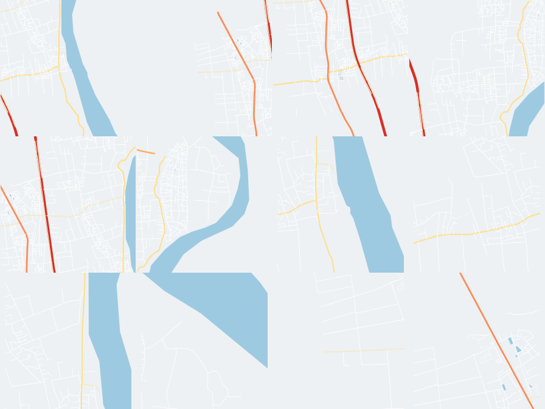

# Kết quả mẫu Track B — xã Chương Dương (để đối chiếu)

> **Đây không phải hướng dẫn làm** — hướng dẫn làm nằm ở
> [`docs/chuong_duong_track_b_pilot_guide.md`](chuong_duong_track_b_pilot_guide.md).
>
> **Tài liệu này cho xem kết quả THẬT** sau khi chạy xong toàn bộ pipeline
> trên xã Chương Dương, để khi bạn làm xã/phường khác, bạn biết **hình dạng
> đúng** trông như thế nào — số liệu của bạn sẽ khác (vì xã khác nhau), nhưng
> **cấu trúc cột, kiểu dữ liệu, và cách các file khớp với nhau phải giống hệt
> thế này**. Nếu output của bạn thiếu cột, sai kiểu dữ liệu, hoặc file không
> mở được — so với tài liệu này để biết mình sai ở đâu.

---

## 1. Toàn bộ file kết quả sau khi làm xong

```text
data/processed/pilots/chuong_duong/
├── cells.parquet                    # sau bước B2 — chỉ có lưới H3 thô
├── cells_geometry.geojson           # hình lục giác, chỉ để xem QGIS
├── cells_b4.parquet                 # + đặc trưng đường (B4)
├── cells_b4_qa.json
├── cells_b5.parquet                 # + dân số/POI (B5)
├── cells_b5_qa.json
├── cells_b3.parquet                 # ⭐ BẢNG CUỐI CÙNG — đủ B2+B4+B5+B3
├── cell_images/                     # 41 ảnh PNG, tên = h3_index
│   ├── 87414345bffffff.png
│   ├── 8741437a2ffffff.png
│   └── ... (39 ảnh khác)
├── cell_images_contact_sheet.png    # ghép 12 ảnh đầu để xem nhanh
├── weather_2019_01_04.parquet       # thời tiết mẫu (chỉ 4 tháng đầu 2019)
└── weather_2019_01_04_qa.json
```

**File quan trọng nhất để kiểm tra: `cells_b3.parquet`** — đây là bảng gộp đủ
mọi thứ trừ thời tiết (thời tiết đang là file riêng vì mới có dữ liệu 4 tháng
mẫu, chưa đủ 2019-2025).

---

## 2. `cells_b3.parquet` — 19 cột, 41 dòng

### Toàn bộ tên cột (thứ tự đúng)

```text
h3_index, resolution, centroid_lat, centroid_lon, district, ward,
n_intersections, road_length_primary, road_length_secondary,
road_length_residential, n_traffic_signals, n_crossings, has_major_road,
population, population_density, n_schools, n_hospitals, n_commercial_poi,
image_path
```

**Nếu bảng của bạn thiếu cột nào trong danh sách trên, hoặc thừa cột lạ không
có ở đây — dừng lại, kiểm tra lại từng bước B2/B4/B5/B3**, đừng tiếp tục làm
ảnh hay ghép dữ liệu.

### 2 dòng thật, resolution 7 (ô to)

| h3_index | resolution | centroid_lat | centroid_lon | district | ward | n_intersections | road_length_primary | road_length_secondary | road_length_residential | n_traffic_signals | n_crossings | has_major_road | population | population_density | n_schools | n_hospitals | n_commercial_poi |
|---|---|---|---|---|---|---|---|---|---|---|---|---|---|---|---|---|---|
| `87414345bffffff` | 7 | 20.810965 | 105.911249 | *(trống)* | Chương Dương | 13 | 0.0 | 4006.69 | 19001.94 | 0 | 0 | True | 6054.45 | 1069.92 | 0 | 0 | 0 |
| `8741437a2ffffff` | 7 | 20.823708 | 105.870407 | *(trống)* | Chương Dương | 12 | 0.0 | 0.0 | 18738.16 | 0 | 0 | True | 7724.68 | 1364.78 | 0 | 0 | 1 |

### 2 dòng thật, resolution 8 (ô nhỏ)

| h3_index | resolution | centroid_lat | centroid_lon | district | ward | n_intersections | road_length_primary | road_length_secondary | road_length_residential | n_traffic_signals | n_crossings | has_major_road | population | population_density | n_schools | n_hospitals | n_commercial_poi |
|---|---|---|---|---|---|---|---|---|---|---|---|---|---|---|---|---|---|
| `88414345b1fffff` | 8 | 20.810965 | 105.911249 | *(trống)* | Chương Dương | 3 | 0.0 | 1198.21 | 4387.19 | 0 | 0 | True | 1500.95 | 1856.69 | 0 | 0 | 0 |
| `88414345b3fffff` | 8 | 20.812143 | 105.901987 | *(trống)* | Chương Dương | 4 | 0.0 | 853.19 | 8210.51 | 0 | 0 | True | 1734.12 | 2144.99 | 0 | 0 | 0 |

### Ý nghĩa từng cột (đọc kỹ nếu chưa quen)

| Cột | Ý nghĩa | Lưu ý |
|---|---|---|
| `h3_index` | Mã định danh duy nhất của 1 ô lục giác | Không bao giờ trùng trong cùng 1 xã |
| `resolution` | 7 (ô to, ~5.16 km²) hoặc 8 (ô nhỏ, ~0.74 km²) | 2 resolution **chồng lên nhau về không gian** — xem mục 3 |
| `centroid_lat`/`centroid_lon` | Tọa độ tâm ô | WGS84, vĩ độ trước kinh độ |
| `district` | Luôn **trống** trong bộ dữ liệu mới | Địa giới 2025 không còn cấp quận/huyện, không tự suy đoán điền vào |
| `ward` | Tên xã/phường | Lấy đúng từ `hanoi_wards_2025.geojson`, không gõ tay |
| `n_intersections` | Số điểm giao giữa các đường trong ô | Ô Chương Dương mẫu: 3-13 giao lộ/ô |
| `road_length_*` | Tổng chiều dài đường theo cấp, đơn vị **mét** | `road_length_primary = 0.0` là bình thường nếu xã không có đường cấp 1 đi qua ô đó |
| `n_traffic_signals`, `n_crossings` | Đếm theo tag OSM | Bằng 0 nghĩa là OSM chưa gắn tag, **không phải** thực địa không có |
| `has_major_road` | Có đường lớn (motorway/trunk/primary/secondary) đi qua ô | Kiểu boolean `True`/`False` |
| `population` | Tổng dân số trong ô (từ raster WorldPop) | Đơn vị: người |
| `population_density` | Dân số / diện tích ô (km²) | |
| `n_schools`, `n_hospitals`, `n_commercial_poi` | Đếm điểm POI từ OSM | |
| `image_path` | Đường dẫn đến ảnh PNG của ô | Trỏ vào thư mục `cell_images/` |

---

## 3. Vì sao resolution 7 và 8 có thể trùng vị trí — đọc kỹ trước khi báo cáo số liệu

Nhìn 2 dòng đầu ở mục 2: ô res 7 `87414345bffffff` và ô res 8
`88414345b1fffff` có **cùng tọa độ tâm** (`20.810965, 105.911249`). Đây
**không phải lỗi trùng lặp** — res 8 là các ô nhỏ nằm *bên trong* ô res 7 lớn
hơn, giống như bản đồ có 2 lớp lưới chồng lên nhau ở 2 mức phóng to khác nhau.

**Hệ quả bắt buộc phải nhớ:** không được cộng `population` hay
`n_intersections` của tất cả 41 dòng lại rồi nói đó là tổng của cả xã Chương
Dương — con số đó sẽ đếm trùng phần chồng lấn. Muốn biết tổng thật của xã,
chỉ cộng các ô của **một resolution duy nhất** (ví dụ chỉ 6 ô res 7).

QA file `cells_b5_qa.json` đã ghi rõ điều này:
```json
"note_on_total": "H3 resolutions 7 and 8 overlap in this pilot, so this sum is not a physical ward total."
```

---

## 4. Ảnh bản đồ — đối chiếu trực quan



Đây là `cell_images_contact_sheet.png` thật, ghép 12 ảnh đầu tiên. Khi bạn làm
xã khác, ảnh của bạn sẽ có hình dạng đường/sông khác hẳn (vì địa lý khác), **
nhưng phải giống về phong cách**:

- Nền màu xám nhạt đồng nhất, không phải màu trắng trơn hay có watermark.
- Đường tô màu theo cấp: đỏ/cam đậm = đường lớn, vàng/trắng mảnh = đường nhỏ.
- Sông/hồ tô màu xanh nhạt, khối nhà tô xám.
- **Tuyệt đối không có chữ nào trên ảnh** — không tên đường, không tên địa
  danh, không dòng chữ lỗi kiểu "API KEY REQUIRED".
- Các ô cùng resolution nhìn có độ phóng to gần giống nhau.

Nếu ảnh của bạn khác các điểm trên (đặc biệt là có chữ, hoặc gần như trắng
trơn), quay lại bước B3 kiểm tra lại tham số render, đừng chạy tiếp cho toàn
bộ 126 xã/phường.

---

## 5. Thời tiết mẫu — `weather_2019_01_04.parquet`

8 cột: `h3_index`, `time_bin`, `temp_mean`, `precipitation_sum`,
`visibility_min`, `wind_speed_max`, `humidity_mean`, `cloud_cover_mean`.
41 ô × 4 tháng × 4 khung/ngày = **19.721 dòng**.

3 dòng đầu thật (cùng 1 ô, 3 khung giờ liên tiếp trong ngày 01/01/2019):

| h3_index | time_bin | temp_mean | precipitation_sum | visibility_min | wind_speed_max | humidity_mean | cloud_cover_mean |
|---|---|---|---|---|---|---|---|
| `87414345bffffff` | 2019-01-01T06:00:00+07:00 | 11.06 | 0.0 | *(trống)* | 4.47 | 70.91 | 100.0 |
| `87414345bffffff` | 2019-01-01T12:00:00+07:00 | 12.02 | 0.0 | *(trống)* | 4.51 | 67.04 | 99.2 |
| `87414345bffffff` | 2019-01-01T18:00:00+07:00 | 12.04 | 0.0 | *(trống)* | 4.01 | 67.05 | 98.7 |

**Cột `visibility_min` trống toàn bộ** — không phải lỗi của bạn, dữ liệu ERA5
tải theo hướng dẫn hiện tại không có biến này. Đây là giới hạn đã biết, ghi
rõ trong `weather_2019_01_04_qa.json`, chưa cần khắc phục ở bước pilot.

`time_bin` cách nhau đúng 6 giờ trong giờ Việt Nam (`+07:00`) — nếu file của
bạn ra giờ UTC (`+00:00`) hoặc lệch múi giờ, kiểm tra lại bước chuyển đổi
`ingest_era5_weather.py`.

---

## 6. Bảng số liệu tổng hợp mẫu — để so cỡ (không phải để so trùng khớp)

| Chỉ số | Giá trị mẫu Chương Dương | Ghi chú |
|---|---|---|
| Số ô resolution 7 | 6 | Xã khác sẽ ra số khác tùy diện tích |
| Số ô resolution 8 | 35 | |
| Tổng điểm giao (`n_intersections`, cộng cả 41 ô) | 209 | Chỉ để tham khảo, không phải số liệu chính thức của xã |
| Ô có `has_major_road = True` | 26/41 | |
| `population` nhỏ nhất / lớn nhất trong 1 ô | 0.0 / 17.189,9 | Ô ven sông có thể ra 0 dân |
| Số bài kiểm tra `check-refs` khi cắt OSM | `Nodes in ways missing: 0` | **Bắt buộc phải ra đúng số 0** |

**Đừng cố làm ra đúng những con số này ở xã của bạn** — mỗi xã có diện tích,
mật độ đường, dân số khác nhau nên số liệu chắc chắn khác. Mục đích của bảng
này chỉ là để bạn thấy "à, con số cỡ này là hợp lý", chứ không phải đáp án cần khớp.
